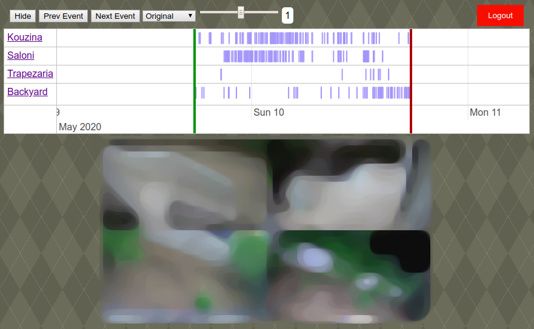

# README #

This Web Application is a nice UI for all your hikvision cameras. It supports Login and it is using native HTML5 without the need to install any other plugin for the client.

### Dependencies ###

It needs PHP version 5.6 or newer for the unpack to support 64 bit format

### How to configure ###

*.htaccess:*

* At the **SetEnv AuthUser** & **SetEnv AuthPass** change it into your own desire.
* At the **SetEnv camPaths** add a comma sepperated list of each path to your cameras **info.bin** files.
* At the **SetEnv camNames** add a comma sepperated list of name the camera names which should be the same size as the camPaths.
* At the **SetEnv camIPs** add a comma sepperated list of the IPs of each camera.
* At the **SetEnv camAuths** add a comma sepperated list of the usernames/passwords for the authentication in this format: "admin:password"

### Credits ###

Used a modified version of libHikvision library by Dave Hope, available at https://github.com/davehope/libHikvision
